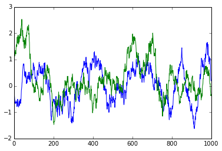
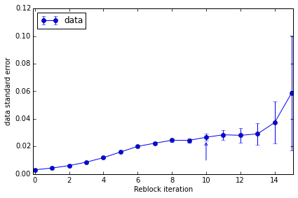

pyblock tutorial
================

The estimate of the standard error of a set of data assumes that the
data points are completely independent. If this is not true, then
naively calculating the standard error of the entire data set can give a
substantial underestimate of the true error. This arises in, for
example, Monte Carlo simulations where the state at one step depends
upon the state at the previous step. Data calculated from the stochastic
state hence has **serial correlations**.

A simple way to remove these correlations is to repeatedly average
neighbouring pairs of data points and calculate the standard error on
the new data set. As no data is discarded in this process (assuming the
data set contains :math:`2^n` values), the error estimate should remain
approximately constant if the data is truly independent.

`pyblock <api.html>`__ is a python module for performing this reblocking
analysis.

Normally correlated data comes from an experiment or simulation but
we'll use randomly generated data which is serially correlated in order
to show how `pyblock <api.html>`__ works.

.. code:: python

    import numpy
    def corr_data(N, L):
        '''Generate random correlated data containing 2^N data points.  
        Randon data is convolved over a 2^L/10 length to give the correlated signal.'''
        return numpy.convolve(numpy.random.randn(2**N), numpy.ones(2**L)/10, 'same')
    rand_data = corr_data(16, 6)
.. code:: python

    plot(rand_data);

.. image:: tutorial_files/tutorial_3_0.png

If we zoom in, we can clearly see that neighbouring data points do not
immediately appear to be independent:

.. code:: python

    plot(rand_data[:1000]);
    plot(rand_data[40000:41000]);

`pyblock <api.html>`__ can perform a reblocking analysis to get a better
estimate of the standard error of the data set:

.. code:: python

    import pyblock
    reblock_data = pyblock.blocking.reblock(rand_data)
    for reblock_iter in reblock_data:
        print(reblock_iter)

.. parsed-literal::

    BlockTuple(block=0, ndata=65536, mean=array(0.029729412388881667), cov=array(0.6337749708548472), std_err=array(0.0031097650382892594), std_err_err=array(8.589659075051008e-06))
    BlockTuple(block=1, ndata=32768, mean=array(0.02972941238888195), cov=array(0.628821230364245), std_err=array(0.004380650753518188), std_err_err=array(1.711217811903889e-05))
    BlockTuple(block=2, ndata=16384, mean=array(0.02972941238888187), cov=array(0.6213291012014514), std_err=array(0.006158158716248116), std_err_err=array(3.402038032828577e-05))
    BlockTuple(block=3, ndata=8192, mean=array(0.0297294123888818), cov=array(0.6072256553888598), std_err=array(0.00860954270047692), std_err_err=array(6.726615807324491e-05))
    BlockTuple(block=4, ndata=4096, mean=array(0.02972941238888184), cov=array(0.5804081640995564), std_err=array(0.0119038318174598), std_err_err=array(0.00013153606075677518))
    BlockTuple(block=5, ndata=2048, mean=array(0.02972941238888185), cov=array(0.5242933503018304), std_err=array(0.01600008163891877), std_err_err=array(0.0002500623334367383))
    BlockTuple(block=6, ndata=1024, mean=array(0.029729412388881837), cov=array(0.4126013837636545), std_err=array(0.02007314222616115), std_err_err=array(0.00044377470816715493))
    BlockTuple(block=7, ndata=512, mean=array(0.029729412388881854), cov=array(0.255910704765131), std_err=array(0.02235677962597468), std_err_err=array(0.0006993326391359534))
    BlockTuple(block=8, ndata=256, mean=array(0.029729412388881854), cov=array(0.15369260703074866), std_err=array(0.024502280428847067), std_err_err=array(0.0010849792138732355))
    BlockTuple(block=9, ndata=128, mean=array(0.029729412388881844), cov=array(0.07649773732547502), std_err=array(0.02444664747680699), std_err_err=array(0.0015339190875488663))
    BlockTuple(block=10, ndata=64, mean=array(0.02972941238888185), cov=array(0.0455635621966979), std_err=array(0.026682028770755133), std_err_err=array(0.002377024048671685))
    BlockTuple(block=11, ndata=32, mean=array(0.029729412388881847), cov=array(0.025945495376626042), std_err=array(0.028474492629712717), std_err_err=array(0.003616264180239503))
    BlockTuple(block=12, ndata=16, mean=array(0.02972941238888184), cov=array(0.012627881930728472), std_err=array(0.02809346224071589), std_err_err=array(0.0051291409958865745))
    BlockTuple(block=13, ndata=8, mean=array(0.02972941238888184), cov=array(0.006785523206998811), std_err=array(0.029123708570078285), std_err_err=array(0.00778363852153464))
    BlockTuple(block=14, ndata=4, mean=array(0.02972941238888184), cov=array(0.005573075663761713), std_err=array(0.037326517597285024), std_err_err=array(0.015238486998060912))
    BlockTuple(block=15, ndata=2, mean=array(0.02972941238888184), cov=array(0.006933024981306826), std_err=array(0.05887709648626886), std_err_err=array(0.04163239418201536))

The standard error of the original data set is clearly around 8 times
too small. Note that the standard error of the last few reblock
iterations fluctuates substantially---this is simply because of the
small number of data points at those iterations.

In addition to the mean and standard error at each iteration, the
covariance and an estimate of the error in the standard error are also
calculated. Each tuple also contains the number of data points used at
the given reblock iteration.

`pyblock.blocking <pyblock.blocking.html>`__ can also suggest the
reblock iteration at which the standard error has converged (i.e. the
iteration at which the serial correlation has been removed and every
data point is truly independent).

.. code:: python

    opt = pyblock.blocking.find_optimal_block(len(rand_data), reblock_data)
    print(opt)
    print(reblock_data[opt[0]])

.. parsed-literal::

    [10]
    BlockTuple(block=10, ndata=64, mean=array(0.02972941238888185), cov=array(0.0455635621966979), std_err=array(0.026682028770755133), std_err_err=array(0.002377024048671685))

Whilst the above uses just a single data set, `pyblock <api.html>`__ is
designed to work on multiple data sets at once (e.g. multiple outputs
from the same simulation). In that case, different optimal reblock
iterations might be found for each data set. The only assumption is that
the original data sets are of the same length.

pandas integration
------------------

The core `pyblock <api.html>`__ functionality is built upon ``numpy``.
However, it is more convenient to use the ``pandas``-based wrapper
around `pyblock.blocking <pyblock.blocking.html>`__, not least because
it makes working with multiple data sets more pleasant.

.. code:: python

    import pandas as pd
    rand_data = pd.Series(rand_data)
.. code:: python

    rand_data.head()

.. parsed-literal::

    0   -0.294901
    1   -0.360847
    2   -0.386010
    3   -0.496183
    4   -0.625507
    dtype: float64

.. code:: python

    (data_length, reblock_data, covariance) = pyblock.pd_utils.reblock(rand_data)
.. code:: python

    # number of data points at each reblock iteration
    data_length

.. parsed-literal::

    reblock
    0          65536
    1          32768
    2          16384
    3           8192
    4           4096
    5           2048
    6           1024
    7            512
    8            256
    9            128
    10            64
    11            32
    12            16
    13             8
    14             4
    15             2
    Name: data length, dtype: int64

.. code:: python

    # mean, standard error and estimate of the error in the standard error at each 
    # reblock iteration
    # Note the suggested reblock iteration is already indicated.
    # pyblock names the data series 'data' if no name is provided in the
    pandas.Series/pandas.DataFrame.
    reblock_data

.. raw:: html

    

    <table border="1" class="dataframe">
      <thead>
        <tr>
          <th></th>
          <th colspan="4" halign="left">data</th>
        </tr>
        <tr>
          <th></th>
          <th>mean</th>
          <th>standard error</th>
          <th>standard error error</th>
          <th>optimal block</th>
        </tr>
        <tr>
          <th>reblock</th>
          <th></th>
          <th></th>
          <th></th>
          <th></th>
        </tr>
      </thead>
      <tbody>
        <tr>
          <th>0 </th>
          <td> 0.029729</td>
          <td> 0.003110</td>
          <td> 0.000009</td>
          <td>         </td>
        </tr>
        <tr>
          <th>1 </th>
          <td> 0.029729</td>
          <td> 0.004381</td>
          <td> 0.000017</td>
          <td>         </td>
        </tr>
        <tr>
          <th>2 </th>
          <td> 0.029729</td>
          <td> 0.006158</td>
          <td> 0.000034</td>
          <td>         </td>
        </tr>
        <tr>
          <th>3 </th>
          <td> 0.029729</td>
          <td> 0.008610</td>
          <td> 0.000067</td>
          <td>         </td>
        </tr>
        <tr>
          <th>4 </th>
          <td> 0.029729</td>
          <td> 0.011904</td>
          <td> 0.000132</td>
          <td>         </td>
        </tr>
        <tr>
          <th>5 </th>
          <td> 0.029729</td>
          <td> 0.016000</td>
          <td> 0.000250</td>
          <td>         </td>
        </tr>
        <tr>
          <th>6 </th>
          <td> 0.029729</td>
          <td> 0.020073</td>
          <td> 0.000444</td>
          <td>         </td>
        </tr>
        <tr>
          <th>7 </th>
          <td> 0.029729</td>
          <td> 0.022357</td>
          <td> 0.000699</td>
          <td>         </td>
        </tr>
        <tr>
          <th>8 </th>
          <td> 0.029729</td>
          <td> 0.024502</td>
          <td> 0.001085</td>
          <td>         </td>
        </tr>
        <tr>
          <th>9 </th>
          <td> 0.029729</td>
          <td> 0.024447</td>
          <td> 0.001534</td>
          <td>         </td>
        </tr>
        <tr>
          <th>10</th>
          <td> 0.029729</td>
          <td> 0.026682</td>
          <td> 0.002377</td>
          <td> &lt;---    </td>
        </tr>
        <tr>
          <th>11</th>
          <td> 0.029729</td>
          <td> 0.028474</td>
          <td> 0.003616</td>
          <td>         </td>
        </tr>
        <tr>
          <th>12</th>
          <td> 0.029729</td>
          <td> 0.028093</td>
          <td> 0.005129</td>
          <td>         </td>
        </tr>
        <tr>
          <th>13</th>
          <td> 0.029729</td>
          <td> 0.029124</td>
          <td> 0.007784</td>
          <td>         </td>
        </tr>
        <tr>
          <th>14</th>
          <td> 0.029729</td>
          <td> 0.037327</td>
          <td> 0.015238</td>
          <td>         </td>
        </tr>
        <tr>
          <th>15</th>
          <td> 0.029729</td>
          <td> 0.058877</td>
          <td> 0.041632</td>
          <td>         </td>
        </tr>
      </tbody>
    </table>
    
16 rows × 4 columns

    

.. code:: python

    # Covariance matrix is not so relevant for a single data set.
    covariance

.. raw:: html

    

    <table border="1" class="dataframe">
      <thead>
        <tr style="text-align: right;">
          <th></th>
          <th></th>
          <th>data</th>
        </tr>
        <tr>
          <th>reblock</th>
          <th></th>
          <th></th>
        </tr>
      </thead>
      <tbody>
        <tr>
          <th>0 </th>
          <th>data</th>
          <td> 0.633775</td>
        </tr>
        <tr>
          <th>1 </th>
          <th>data</th>
          <td> 0.628821</td>
        </tr>
        <tr>
          <th>2 </th>
          <th>data</th>
          <td> 0.621329</td>
        </tr>
        <tr>
          <th>3 </th>
          <th>data</th>
          <td> 0.607226</td>
        </tr>
        <tr>
          <th>4 </th>
          <th>data</th>
          <td> 0.580408</td>
        </tr>
        <tr>
          <th>5 </th>
          <th>data</th>
          <td> 0.524293</td>
        </tr>
        <tr>
          <th>6 </th>
          <th>data</th>
          <td> 0.412601</td>
        </tr>
        <tr>
          <th>7 </th>
          <th>data</th>
          <td> 0.255911</td>
        </tr>
        <tr>
          <th>8 </th>
          <th>data</th>
          <td> 0.153693</td>
        </tr>
        <tr>
          <th>9 </th>
          <th>data</th>
          <td> 0.076498</td>
        </tr>
        <tr>
          <th>10</th>
          <th>data</th>
          <td> 0.045564</td>
        </tr>
        <tr>
          <th>11</th>
          <th>data</th>
          <td> 0.025945</td>
        </tr>
        <tr>
          <th>12</th>
          <th>data</th>
          <td> 0.012628</td>
        </tr>
        <tr>
          <th>13</th>
          <th>data</th>
          <td> 0.006786</td>
        </tr>
        <tr>
          <th>14</th>
          <th>data</th>
          <td> 0.005573</td>
        </tr>
        <tr>
          <th>15</th>
          <th>data</th>
          <td> 0.006933</td>
        </tr>
      </tbody>
    </table>
    
16 rows × 1 columns

    

We can also plot the convergence of the standard error estimate and
obtain a summary of the suggested data to quote:

.. code:: python

    pyblock.pd_utils.plot_reblocking(reblock_data);

The standard error clearly converges to ~0.022. The suggested reblock
iteration (which uses a slightly conservative formula) is indicated by
the arrow on the plot.

.. code:: python

    pyblock.pd_utils.reblock_summary(reblock_data)

.. raw:: html

    

    <table border="1" class="dataframe">
      <thead>
        <tr style="text-align: right;">
          <th></th>
          <th>mean</th>
          <th>standard error</th>
          <th>standard error error</th>
        </tr>
      </thead>
      <tbody>
        <tr>
          <th>data</th>
          <td> 0.02972941</td>
          <td> 0.02668203</td>
          <td> 0.002377024</td>
        </tr>
      </tbody>
    </table>
    
1 rows × 3 columns

    

`pyblock.error <pyblock.error.html>`__ also contains simple error
propogation functions for combining multiple noisy data sets and can
handle multiple data sets at once (contained either within a ``numpy``
array using `pyblock.blocking <pyblock.blocking.html>`__ or within a
``pandas.DataFrame``.
